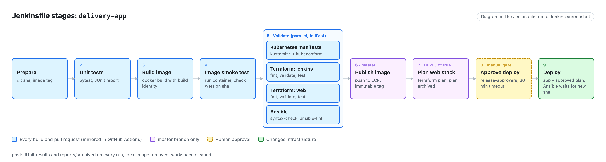
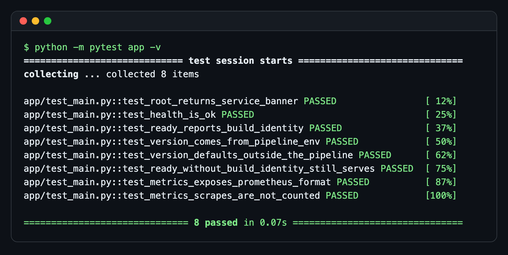
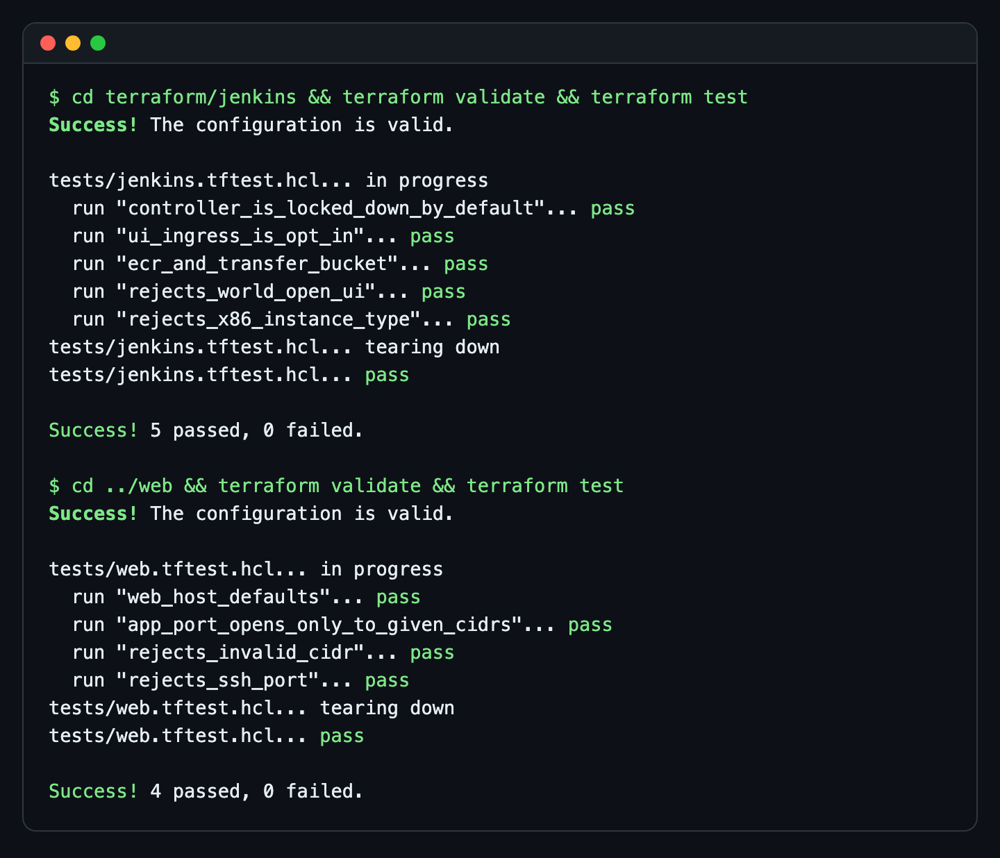
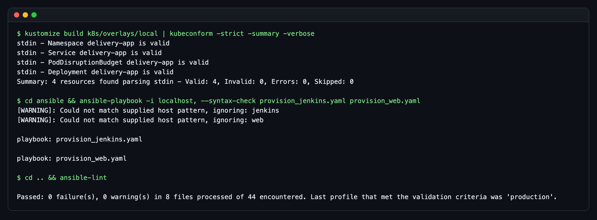
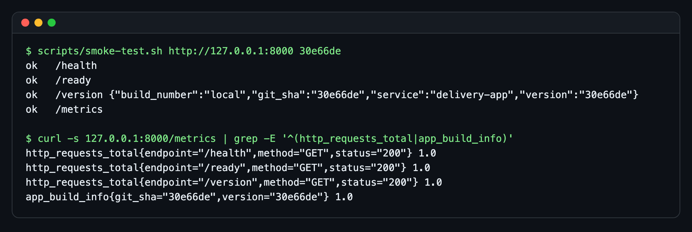
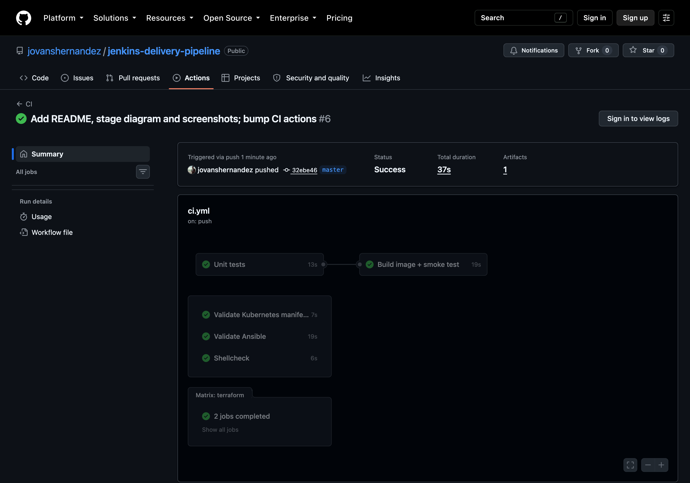

# jenkins-delivery-pipeline

[](https://github.com/jovanshernandez/jenkins-delivery-pipeline/actions/workflows/ci.yml)

A reference delivery pipeline for a small Python service. A declarative Jenkinsfile takes
every commit through unit tests, an image build, a container smoke test and a parallel
validation stage (Kubernetes manifests, two Terraform stacks, Ansible). On `master` it
publishes the image to ECR. With `DEPLOY=true` it plans the web stack, waits for a human
approval, applies the approved plan and deploys with Ansible. Ansible only reports success
once the host serves the new commit. GitHub Actions runs every stage that does not need
AWS credentials on each push.



*Diagram of the stages in the [Jenkinsfile](Jenkinsfile), not a screenshot of a Jenkins
instance.*

| Unit tests | Terraform validate and mocked-provider tests |
| --- | --- |
|  |  |

| Kubernetes and Ansible validation | Local smoke test |
| --- | --- |
|  |  |

GitHub Actions runs the credential-free stages on every push:



## Features

- **Declarative Jenkinsfile** with build identity (`<sha>-<build>` image tags), a
  `failFast` parallel validation stage, archived JUnit results, rendered manifests and
  Terraform plan, a timed manual approval restricted to `release-approvers`, and `post`
  cleanup.
- **Promotion gates**: a build only reaches the web host after tests, the image smoke
  test, all validation branches, publish on `master`, an archived plan and an approval.
  Deploy applies that exact plan file.
- **Sample service `delivery-app`** (Flask + gunicorn): `/health`, `/ready`, `/version`
  (git sha and build number baked in by the pipeline) and Prometheus `/metrics` with
  request counts, latency histogram and an `app_build_info` series.
- **Terraform**: `jenkins` and `web` stacks built on a shared `ssm-host` module. No key
  pairs and no port 22 (access through SSM Session Manager), IMDSv2 required, encrypted gp3
  root volumes, Graviton instances on Amazon Linux 2023, ingress closed unless CIDRs are
  set, an immutable-tag ECR repository with a lifecycle policy, and validation on every
  input variable.
- **Terraform tests** (`terraform test` with `mock_provider "aws"`) assert the security
  posture and the validation rules without credentials or API calls.
- **Ansible** configures the Jenkins controller with every tool the Jenkinsfile calls,
  and deploys the app on the web host as a read-only container under systemd. It reaches
  both hosts through a dynamic EC2 inventory and the `aws_ssm` connection.
- **Kubernetes** base and local overlay: rolling updates with no unavailable pods,
  probes, resource requests, PodDisruptionBudget, non-root read-only container. Validated
  with `kubeconform -strict`.

## Pipeline stages

| # | Jenkins stage | Runs when | What it does | In GitHub Actions |
| --- | --- | --- | --- | --- |
| 1 | Prepare | always | Computes `GIT_SHA`, `APP_VERSION`, `IMAGE_TAG` | yes (inline) |
| 2 | Unit tests | always | `pytest`, JUnit report to `reports/` | `Unit tests` |
| 3 | Build image | always | `docker build` with build identity as build args | `Build image + smoke test` |
| 4 | Image smoke test | always | Runs the image, checks endpoints and that `/version` reports this commit | `Build image + smoke test` |
| 5 | Validate / Kubernetes manifests | always | `kubectl kustomize` then `kubeconform -strict` | `Validate Kubernetes manifests` |
| 5 | Validate / Terraform: jenkins, web | always | `fmt -check`, `init -backend=false`, `validate`, `test` | `Validate Terraform` (matrix) |
| 5 | Validate / Ansible | always | `--syntax-check` on both playbooks, `ansible-lint` | `Validate Ansible` |
| 6 | Publish image | `master` | Push `delivery-app:<sha>-<build>` to ECR | no |
| 7 | Plan web stack | `master` and `DEPLOY` | `terraform plan -out=tfplan`, plan text archived | no |
| 8 | Approve deploy | `master` and `DEPLOY` | `input` limited to `release-approvers`, 30 minute timeout | no |
| 9 | Deploy | `master` and `DEPLOY` | `terraform apply tfplan`, then `provision_web.yaml` waits for the new sha on the host | no |

CI also runs `shellcheck` on `scripts/`.

## Quick start

Requires Python 3.12+ and Terraform 1.10+.

```bash
python3 -m venv .venv
.venv/bin/pip install -r app/requirements-dev.txt
.venv/bin/python -m pytest app -v
```

Run the service and smoke test it:

```bash
GIT_SHA=$(git rev-parse --short=7 HEAD) .venv/bin/gunicorn --chdir app --bind 127.0.0.1:8000 main:app &
scripts/smoke-test.sh http://127.0.0.1:8000 "$(git rev-parse --short=7 HEAD)"
kill %1
```

With Docker, the same check the pipeline runs:

```bash
docker build --build-arg GIT_SHA="$(git rev-parse --short=7 HEAD)" -t delivery-app:local app
scripts/container-smoke.sh delivery-app:local "$(git rev-parse --short=7 HEAD)"
```

Validate the infrastructure code without AWS credentials:

```bash
cd terraform/web
terraform init -backend=false
terraform validate
terraform test
```

Render and validate the manifests (needs `kubectl` and `kubeconform`):

```bash
kubectl kustomize k8s/overlays/local | kubeconform -strict -summary
```

Check the playbooks:

```bash
.venv/bin/pip install ansible-core ansible-lint
(cd ansible && ../.venv/bin/ansible-playbook -i localhost, --syntax-check provision_jenkins.yaml provision_web.yaml)
.venv/bin/ansible-lint
```

## Running it in Jenkins

The Jenkinsfile expects a **Multibranch Pipeline** job, because `when { branch 'master' }`
relies on `BRANCH_NAME`.

- **Agent tools**: `python3` with `venv`, Docker, Terraform 1.10+, `kubectl`,
  `kubeconform`, `ansible-core`, `ansible-lint`, `boto3`, the AWS Session Manager plugin,
  and `amazon-ecr-credential-helper` for `docker push`. `ansible/provision_jenkins.yaml`
  installs all of them on an Amazon Linux 2023 controller.
- **Plugins**: Pipeline, Git or GitHub Branch Source, Timestamper, JUnit, Credentials
  Binding, AWS Credentials, Workspace Cleanup.
- **Credentials**: `aws-deploy` (AWS credentials for the deploy role) and
  `tf-backend-web` (secret file with the web stack's backend config, see
  `terraform/web/backend.hcl.example`).
- **Global environment**: `ECR_REGISTRY` (for example
  `123456789012.dkr.ecr.us-east-1.amazonaws.com`) and `SSM_BUCKET` (the
  `ssm_transfer_bucket` output of `terraform/jenkins`).
- **Approvers**: a user or group named `release-approvers` for the deploy input.

Bootstrapping order, access through SSM, and rollback are in
[docs/operations.md](docs/operations.md).

## Deploy notes

The AWS path has not been run against a live account from this repository. The
Terraform is checked by `validate` and plan-level `terraform test` runs against a mocked
AWS provider. The playbooks are checked by syntax check and `ansible-lint`. The image
is built and smoke-tested in GitHub Actions. To use it for real:

1. `terraform/jenkins`: copy `backend.hcl.example` to `backend.hcl`, then
   `terraform init -backend-config=backend.hcl` and `terraform apply`. This creates the
   controller, the ECR repository and the SSM transfer bucket.
2. Run `ansible-playbook provision_jenkins.yaml` from `ansible/` (dynamic inventory
   `inventory/aws_ec2.yml`, collections from `requirements.yml`).
3. Configure Jenkins as above and run the pipeline on `master` with `DEPLOY=true`. The
   first approved run creates the web host.

Both hosts start with no inbound rules. Open the Jenkins UI or the app port with
`ui_ingress_cidrs` / `app_ingress_cidrs`, or use SSM port forwarding.

## Design notes

- **One image, one identity.** The commit sha is baked into the image as a build arg and
  exposed at `/version` and in `app_build_info`. The container smoke test and the Ansible
  deploy both fail unless the running process reports the sha that was built, so "deployed"
  means the right build is serving, not just that a command exited 0.
- **Plan, approve, apply the same plan.** The approval gate sits between an archived
  `terraform plan -out` and `terraform apply tfplan`, so the approver reviews exactly
  what will change.
- **Immutable tags** in ECR make rollback a redeploy of an earlier tag
  ([docs/operations.md](docs/operations.md#rollback)).
- **No SSH anywhere.** Hosts have no key pair or port 22. Operators and Ansible connect
  through SSM, and the module rejects port 22 in its ingress validation.
- **Least privilege per host.** The controller's instance role can push only to the
  `delivery-app` repository. The web host can only pull. Terraform and Ansible deploys
  use a separate `aws-deploy` credential scoped to the deploy.
- **Kubernetes is the cluster packaging, EC2 is the deploy target.** The manifests are
  rendered and schema-checked on every build so the same image can run on a cluster
  (`kind` or `minikube` with the `local` overlay). The pipeline itself deploys to the EC2
  web host.
- **Single gunicorn worker with threads** keeps the in-process Prometheus metrics
  consistent without multiprocess mode.

## Testing

| Layer | Command | Where it runs |
| --- | --- | --- |
| App | `python -m pytest app` (8 tests) | Jenkins, Actions, local |
| Image | `scripts/container-smoke.sh IMAGE SHA` | Jenkins, Actions |
| Terraform | `terraform test` in each stack (9 runs, mocked AWS) | Jenkins, Actions, local |
| Kubernetes | `kubeconform -strict` on the rendered overlay | Jenkins, Actions, local |
| Ansible | `--syntax-check`, `ansible-lint` (production profile) | Jenkins, Actions, local |
| Shell | `shellcheck scripts/*.sh` | Actions |
| Deploy | Ansible waits for `/version` to report the new sha | Jenkins |

## Project layout

```text
.
├── Jenkinsfile                   # declarative pipeline (stages above)
├── .github/workflows/ci.yml      # Actions mirror of the credential-free stages
├── app/                          # delivery-app: Flask service, tests, Dockerfile
├── k8s/
│   ├── base/                     # Deployment, Service, PodDisruptionBudget
│   └── overlays/local/           # namespace + local image tag
├── terraform/
│   ├── modules/ssm-host/         # EC2 + SG + IAM role, SSM only, IMDSv2, encrypted gp3
│   ├── jenkins/                  # controller, ECR repository, SSM transfer bucket, tests/
│   └── web/                      # web host, tests/
├── ansible/
│   ├── provision_jenkins.yaml    # Jenkins + pipeline toolchain on Amazon Linux 2023
│   ├── provision_web.yaml        # Docker + systemd unit, waits for the new sha
│   ├── inventory/aws_ec2.yml     # dynamic inventory by App/Component tags
│   └── group_vars/all.yml        # aws_ssm connection settings
├── scripts/
│   ├── smoke-test.sh             # endpoint checks, optional expected sha
│   └── container-smoke.sh        # run an image and smoke test it
└── docs/
    ├── operations.md             # gates, access, rollback, bootstrapping
    ├── diagram/pipeline.html     # source of the stage diagram
    └── images/
```
